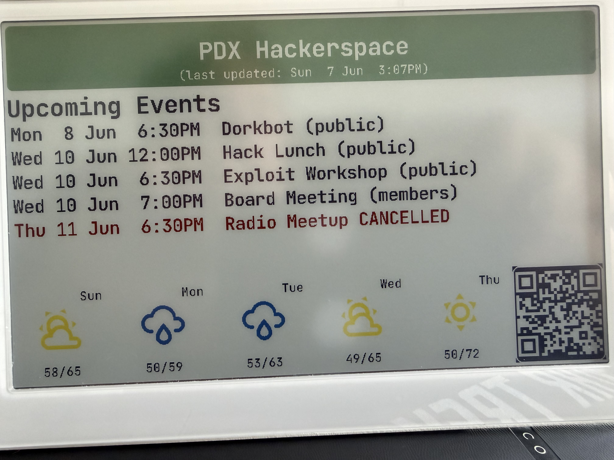
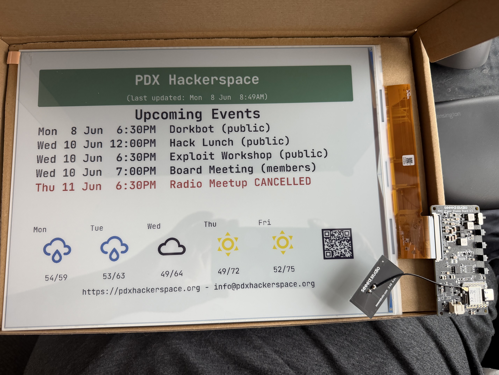

# E-ink Event Sign For PDX Hackerspace

[](https://github.com/romkey/pdxhackerspace-events-eink-sign/actions/workflows/esphome.yml)

Since we now have an [event manager](https://github.com/pdxhackerspace/event-manager) at the hackerspace, I've been wanting to build a smart sign to hang in the doorway that would give a list of upcoming events.

I got hung up on the idea of an e-ink sign because e-ink is pretty and looks sharp. It's also great for power savings, although the way I'm envisioning using this we'll keep it powered all the time, but it could be battery powered and just wake up and refresh once every 30 minutes or however long made sense.

## Hardware

I have this running on three different platforms:
 - [SeeedStudio ReTerminal 7.3" "Full-color" (6 color) ePaper display](https://www.seeedstudio.com/reTerminal-E1002-p-6533.html)
- [SeeedStudio EE04 controller](https://www.seeedstudio.com/XIAO-ePaper-Display-Board-EE04-p-6560.html) with [7.3" Spectra6 800x480 ePaper display](https://www.seeedstudio.com/7-3inch-Six-Color-eInk-ePaper-Display-with-800x480-Pixels-p-6567.html)
- [SeeedStudio EE02 controller](https://www.seeedstudio.com/XIAO-ePaper-DIY-Kit-EE02-for-13-3-Spectratm-6-E-Ink.html) with [13.3" Spectra6 1200x1600 ePaper display](https://www.seeedstudio.com/13-3inch-Six-Color-eInk-ePaper-Display-with-1200x1600-Pixels-p-6569.html)

 

It should be relatively easy to adapt this to other controllers; you'd need to change the pins used but the LVGL code should still work without modifications.

SeeedStudio is shipping a revised version of the EE04 - the original version had a defect that could damage panels and I may have run into that, not sure. I'm holding off on doing more work with the EE04 until I get the revised version.

I can **hear** the EE02 update the display. I think the inductors on the board are whining, and I can also hear a surprising soft *ker-chunk* on updates... so I'm going to check in with SeeedStudio to make sure this is expect and okay, because it's a bit alarming. (Yes, I've heard plenty of inductors whine in my life but I wasn't expecting that from this board).

## Firmware
 
All are running firmware built with [ESPHome](https://esphome.io) using LVGL. ESPHome has integrated support for the 7.3" ePaper display and an [outstanding PR for the 13.3" display](https://github.com/esphome/esphome/pull/13860), which I had to make a few changes to and will contribute back.

I wrote the initial firmware by hand and then put it down for a few months. When I came back to it I tried having Claude update it - Opus 4.8 did a great job and is apparently adept at writing ESPHome firmware now. It also made the changes to the 13.3" PR.

I'm sharing this in the spirit of sharing but I'm not intending to generalize this or offer support to anyone trying to use it.

## Docker

`docker-compose.yaml` runs ESPHome with `./src` mounted as `/config`. Config YAML and `local_components` live in `src/`.

### Setup (once)

```bash
cp src/secrets.yaml.example src/secrets.yaml   # edit with your Wi-Fi credentials
```

### Dashboard (edit YAML, compile, OTA upload)

```bash
docker compose up
open http://localhost:6052
```

### One-shot compile

Replace the config name with the device you are building:

- `reterminal.yaml` — ReTerminal 7.3"
- `seeed-spectra6.yaml` — EE04 + 7.3" Spectra6
- `seeed-spectra6-13.yaml` — EE02 + 13.3" Spectra6

```bash
docker compose run --rm esphome compile seeed-spectra6-13.yaml
```

### One-shot OTA upload

Device must already be on the network and have been flashed at least once.

```bash
docker compose run --rm esphome upload seeed-spectra6-13.yaml
```

### Logs

```bash
docker compose run --rm esphome logs seeed-spectra6-13.yaml
```

USB serial flash from Docker works on Linux only. On macOS, compile here and flash via the dashboard OTA/web installer, or use ESPHome natively for USB.

## License

My code is offered under the MIT License. The PR should be considered to be under [ESPHome's License](https://github.com/esphome/esphome/blob/dev/LICENSE).
